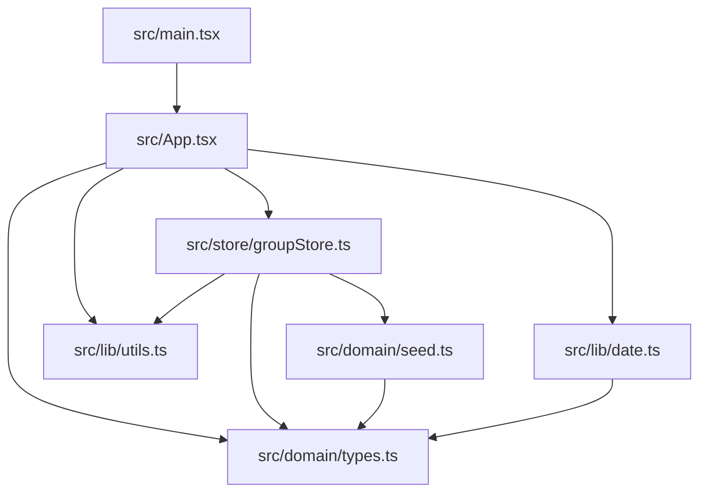

# Component Graph

## `src/App.tsx`

Owns the first usable screen:

- Header metrics.
- Member creation and selection.
- Session creation and selection.
- Attendance marking for the selected session.
- Timeline entry creation for the selected member.
- Meeting weekday setting.

Internal helper components:

- `Metric`
- `Panel`
- `Field`
- `MemberSummary`
- `Timeline`
- `EmptyState`

Split candidates when the file grows:

- `src/features/members/*`
- `src/features/sessions/*`
- `src/features/attendance/*`
- `src/features/timeline/*`
- `src/features/settings/*`

Do not split only for style preference. Split when a feature has enough form,
list, and interaction logic that ownership becomes clearer outside `App.tsx`.

## `src/store/groupStore.ts`

Owns all persistent mutations:

- `addMember`
- `addSession`
- `addTimelineEntry`
- `setAttendance`
- `updateMeetingWeekday`

Do not mutate local storage directly from components.

## `src/domain/types.ts`

Stable domain contract. Prefer additive changes over renaming existing fields.

## `src/lib/date.ts`

Date labels, weekday options, and next-meeting calculation.

## `src/lib/utils.ts`

Generic frontend utilities only. Do not add domain logic here.

## UI State Ownership

`App.tsx` owns temporary selection state:

- `selectedMemberId`
- `selectedSessionId`

Persistent state should stay in `src/store/groupStore.ts`. Do not mirror store
collections into component state unless there is a concrete UI reason.
